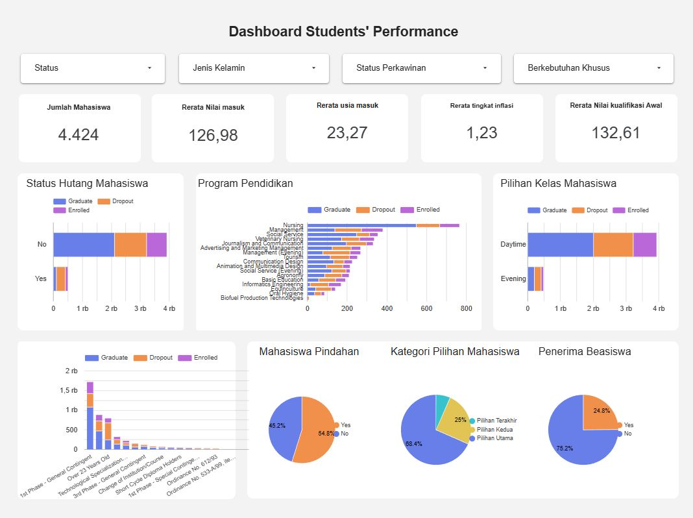

# Proyek Akhir: Menyelesaikan Permasalahan Perusahaan Edutech

## Business Understanding

### Permasalahan Bisnis

Jaya Jaya Institut mengalami tingkat dropout siswa yang tinggi, yang dapat berdampak negatif terhadap reputasi institut.

### Cakupan Proyek

1. Menganalisis faktor-faktor yang memengaruhi dropout siswa.
2. Membangun model prediktif untuk mengidentifikasi siswa yang berpotensi dropout.
3. Menyediakan dashboard interaktif agar pihak manajemen dapat:
   - Memantau performa siswa secara real-time.
   - Mengambil keputusan berbasis data untuk intervensi dan pembimbingan.

### Persiapan

Sumber data: https://raw.githubusercontent.com/dicodingacademy/dicoding_dataset/refs/heads/main/students_performance/data.csv

Setup environment:

```
pip install -r requirements.txt
```

## Business Dashboard

Dashboard yang dibuat Menggunakan looker studio dan dapat diakses dengan link berikut:
https://lookerstudio.google.com/reporting/97e3bd42-5a46-4eec-b94a-f555f6669da4

## Menjalankan Sistem Machine Learning
Prototype machine learning menggunakan streamlit dan dapat diakses dengan link berikut:


## Conclusion

1. Program pendidikan yang paling banyak mahasiswa keluar adalah management dengan total 270 (19% mahasiswa keluar)
2. Rata-rata nilai masuk mahasiwa yang keluar ialah 124.96 (berbeda 4 point dari rata-rata mahasiswa yang berhasil lulus)
3. Rata-rata usia masuk mahasiswa yang keluar ialah 26 tahun (rata-rata usia masuk mahasiswa yang berhasil lulus ialah di bawah 22 tahun)
4. Rata-rata tingkat inflasi pada waktu mahasiswa keluar ialah 1.28 (berbeda 0.08 dari rata-rata inflasi mahasiswa yang lulus)

### Rekomendasi Action Items

#### Fokus Intervensi pada Program Studi Manajemen
1. Audit kurikulum dan beban studi program manajemen untuk mencari penyebab internal (misalnya, beban terlalu berat atau materi tidak sesuai ekspektasi).
2. Perkuat sistem mentoring dan pendampingan akademik, khususnya untuk mahasiswa manajemen tahun pertama.
3. Lakukan survei internal untuk mengetahui kepuasan dan tantangan mahasiswa program tersebut.

#### Deteksi Dini Berdasarkan Nilai Masuk
1. Tawarkan program bimbingan akademik atau remedial sejak semester awal untuk mahasiswa dengan nilai masuk rendah.
2. Kembangkan sistem peringatan dini (early warning system) berbasis data akademik awal.

#### Perhatikan Usia Mahasiswa Saat Masuk
1. Buat program dukungan khusus untuk mahasiswa non-tradisional (usia > 24 tahun), seperti:
   - Konseling akademik dan psikologis
   - Komunitas belajar atau peer support group
2. Telusuri apakah ada kendala ekonomi atau tanggung jawab keluarga yang memengaruhi mahasiswa lebih tua.

Selain itu saat terjadi inflasi tinggi, pihak manajemen perlu mempersiapkan program-program yang dapat membantu mahasiswa untuk tetap bertahan di kampus seperti:
- Program beasiswa
- Program magang dibayar
- program cicilan pendidikan

## Dashboard
